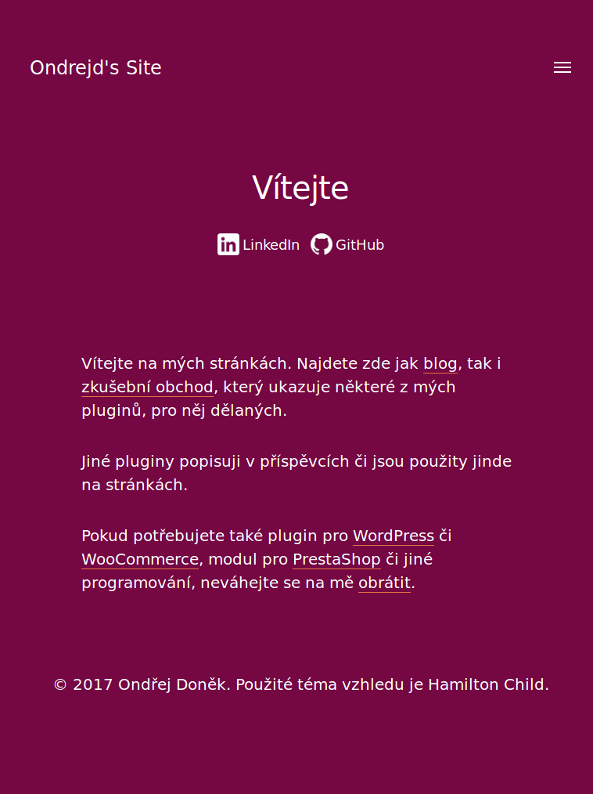
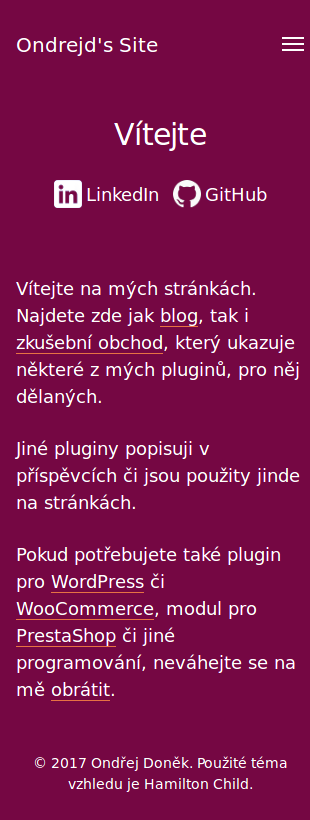

# Hamilton Child Theme
Child of __Hamilton theme__ by [Anders Norén][6] used on [ondrejd.com][2] site.

## New Features
Here is a list of new features that brings this child theme:
+ full __Czech localization__ (included also localization of parent theme),
+ updates in [WordPress Theme Customizer][7]:
  - section __Colors__ - new options _Secondary background color_, _Foreground color_, _Highlight Color_,
  - section __Theme options__ - new options _Show site description_, _Footer text_,
  - new section __Blog Page Display__ - with options _Show blog filter_, _Show Category_, _Show Date and Time_, _Show Excerpt_ and _Show Tags_,
  - new sections for better support of __WooCommerce__:
    - section __Shop Page Display__ with several look settings,
    - ~~section __Cart Page Display__ and __Checkout Page Display__ with several look and content settings just as with some of _WC_ default options converted into __Theme Customizer__ for easier using in our site~~,
  - ~~section __Login Page Display__ with options: _..._~~,
+ support for [WooCommerce][8] plugin,
+ ~~default [WordPress][1] __Login Page__ has same style as rest of the site~~,
+ ~~same style for _WP_ login page as for the rest of the site~~,
+ ~~templates for some _custom post types_ from my plugins - _notice_ from plugin [Notices Generator][3], _project_ from [odwp-projects][4] and *odwpdp_cpt* from [Downloads Plugin][5]~~.

## Installation
+ unpack archive with theme into your `/wp-content/themes` directory,
+ go into [WordPress][1] administration and install also __Hamilton__ theme,
+ now is time to activate __Hamilton Child__ theme.

## TODO
Features which was crossed above are also here in _TODO_ list:
+ same style for ___WP_ login page__ as for the rest of the site
+ templates for some _custom post types_ from my plugins - _notice_ from plugin [Notices Generator][3], _project_ from [odwp-projects][4] and *odwpdp_cpt* from [Downloads Plugin][5].

## Screenshots
Here are screenshots that came from my local development version:

### Desktop

### Tablet

### Mobile

[1]:https://wordpress.org/
[2]:https://ondrejd.com/
[3]:https://github.com/ondrejd/odwp-notices_generator
[4]:https://github.com/ondrejd/odwp-projects
[5]:https://github.com/ondrejd/od-downloads-plugin
[6]:http://www.andersnoren.se/
[7]:https://developer.wordpress.org/themes/customize-api/
[8]:https://woocommerce.com/
