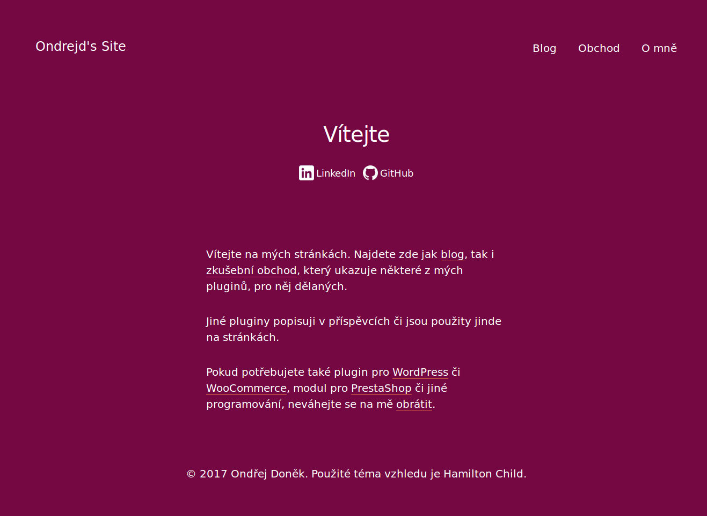

# Hamilton Child Theme
Child of __Hamilton theme__ by [Anders Norén][6] used on [ondrejd.com][2] site.

## New Features
Here is a list of new features that brings this child theme:
+ Czech localization
+ new options in [WordPress Theme Customizer][7] - _Secondary background color_, _Foreground color_ - both in _Colors_ section; _Show site description_, _Footer text_ in _Theme options_,
+ ~~[WooCommerce][8] integration~~,
+ ~~templates for some _custom post types_ from my plugins - _notice_ from plugin [Notices Generator][3], _project_ from [odwp-projects][4] and _odwpdp_cpt_ from [Downloads Plugin][5]~~.

## Installation
+ unpack archive with theme into your `/wp-content/themes` directory,
+ go into [WordPress][1] administration and install also __Hamilton__ theme,
+ now is time to activate __Hamilton Child__ theme.

## TODO
Features which was crossed above are also here in _TODO_ list:
+ [WooCommerce][8] integration,
+ templates for some _CPT_ from my plugins - _notice_ from plugin [Notices Generator][3], _project_ from [odwp-projects][4] and _odwpdp_cpt_ from [Downloads Plugin][5].

## Screenshots
Here is screenshot that came from my local development version:

[1]:https://wordpress.org/
[2]:https://ondrejd.com/
[3]:https://github.com/ondrejd/odwp-notices_generator
[4]:https://github.com/ondrejd/odwp-projects
[5]:https://github.com/ondrejd/od-downloads-plugin
[6]:http://www.andersnoren.se/
[7]:https://developer.wordpress.org/themes/customize-api/
[8]:https://woocommerce.net/
